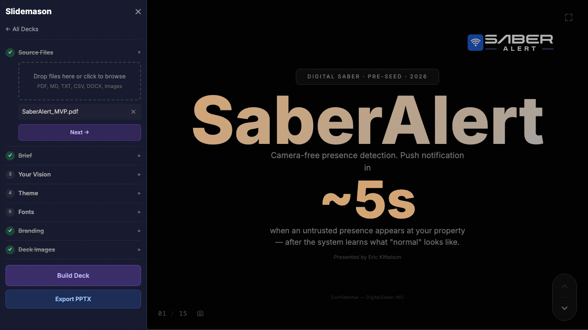

<div align="center">

# Slidemason

**Local-first, open-source presentation builder powered by AI coding agents.**

Turn your notes, documents, and data into polished slide decks — without SaaS, without lock-in,<br>and without leaving your editor. Every slide is custom React. No templates. No cookie-cutter layouts.

[](LICENSE)
[](https://www.typescriptlang.org/)
[](https://react.dev/)
[](https://vite.dev/)
[](https://pnpm.io/)



</div>

---

## Why Slidemason?

| | Traditional tools | Slidemason |
|---|---|---|
| **Design** | Pick a template, fight with it | Every slide is bespoke — unique layout, typography, animations |
| **Data** | Copy-paste into chart wizards | Upload source docs, agent reads and structures everything |
| **Time** | 2-4 hours per deck | Under 5 minutes |
| **Cost** | $20-30/mo for Canva/Gamma/Beautiful.ai | Free and open source. Agent costs ~8-40 cents per deck |
| **Privacy** | Your data on their servers | 100% local. Nothing leaves your machine |
| **Lock-in** | Proprietary formats | Standard React, JSON, CSS. Everything is readable and versionable |
| **Agent** | Locked to one AI | Works with Claude Code, Cursor, Copilot, Windsurf, or any coding agent |

---

## Quick Start

```bash
git clone https://github.com/erickittelson/slidemason.git
cd slidemason
pnpm install
pnpm dev        # Studio opens at http://localhost:4200
```

> **Prerequisites:** Node.js 22+, pnpm 10+

---

## Features

- **Local-first** — Your data never leaves your machine. No accounts, no telemetry, no cloud.
- **Any AI agent** — Works with Claude Code, Cursor, Copilot, Windsurf, or any coding agent. Instructions auto-load from `CLAUDE.md` (symlinked to `.cursorrules`, `.windsurfrules`, `.github/copilot-instructions.md`).
- **7-step studio workflow** — Guided sidebar walks you through source files, brief, vision, theme, fonts, branding, and images. Everything saves to a JSON brief your agent reads.
- **36 slide primitives** — Layout components (`Split`, `Grid`, `Stack`), visual atoms (`Card`, `Badge`, `StatBox`, `IconCircle`), data primitives (`Chart`, `DataTable`), animation toolkit (`Animate`, `CountUp`, `TypeWriter`, `Stagger`), and interactive elements (`Tabs`, `Accordion`, `ClickReveal`, `Flipcard`, `Sortable`).
- **12 themes** — Each with 31 CSS variables for backgrounds, text, accents, charts, status colors, shadows, and more. Switch themes instantly.
- **Google Fonts** — Pick heading and body fonts from curated pairings or search the full Google Fonts library.
- **Branding** — Upload your logo (with placement control), set footer text. The agent places them on every slide.
- **Deck images** — Upload images and describe them. The agent knows what each image is and uses them in context.
- **Live preview** — Slides hot-reload in the studio as the agent writes them. Arrow keys to navigate.
- **Export to PPTX** — One-click PowerPoint export from the sidebar. PDF export via Playwright.
- **Crash-proof primitives** — Invalid props fall back gracefully instead of white-screening. AI agents can pass bad values without killing the deck.
- **Deck validation API** — `GET /__api/decks/:slug/validate` renders every slide server-side and reports errors. Agents can self-correct before you even see the deck.
- **Open and inspectable** — Briefs are JSON, slides are TSX, themes are CSS. Everything is readable and version-controllable.

---

## How It Works

The studio sidebar walks you through 7 steps to build a brief. Then your AI agent reads the brief and source files and generates the slides.

| Step | What you do | What happens |
|:---:|---|---|
| **1** | Upload source files | PDFs, markdown, text — drag and drop |
| **2** | Fill out the brief | Audience, goal, tone, slide count, data density, visual style |
| **3** | Add your vision | Free-text instructions: "make it feel urgent", "emphasize Q3 numbers" |
| **4** | Pick a theme | 12 themes, live preview as you browse |
| **5** | Choose fonts | Curated pairings or search Google Fonts |
| **6** | Upload branding | Logo (with placement control) + footer text |
| **7** | Add deck images | Screenshots, diagrams, photos — with descriptions for the agent |

Hit **Build Deck** and the studio saves everything to `brief.json`. Then ask your agent to generate the slides — it reads the brief, source files, and images, and writes `slides.tsx`. Slides hot-reload as the agent writes them.

Once the deck looks good, click **Export PPTX** to download a PowerPoint file, or use Playwright for PDF export.

---

## How Slides Work

Every slide is bespoke JSX — not a template fill-in. The agent designs each slide's layout, typography, colors, and animations from scratch based on the content.

```tsx
import { Slide, Heading, GradientText, Badge, Text, Split, Card, Grid,
         Animate, CountUp, Stagger, StatBox, IconCircle } from '@slidemason/primitives';
import { Zap, Shield, Globe } from 'lucide-react';

const slides = [
  <Slide key="s1" layout="center" bg="mesh">
    <Badge>Series A · 2026</Badge>
    <GradientText size="hero">Product Name</GradientText>
    <Text muted>One line that captures the vision</Text>
  </Slide>,

  <Slide key="s2" layout="free">
    <Animate effect="fade-up">
      <Heading>Key Metric</Heading>
    </Animate>
    <CountUp to={2.3} prefix="$" suffix="M" decimals={1} />
  </Slide>,
];

export default slides;
```

All colors come from theme CSS variables (`var(--sm-primary)`, `var(--sm-surface)`, etc.) so slides look great in any theme without changing code.

---

## Themes

<table>
<tr>
<td><code>midnight</code></td><td><code>slate</code></td><td><code>canvas</code></td><td><code>signal</code></td><td><code>noir</code></td><td><code>dawn</code></td>
</tr>
<tr>
<td><code>boardroom</code></td><td><code>neon</code></td><td><code>forest</code></td><td><code>glacier</code></td><td><code>sunset</code></td><td><code>paper</code></td>
</tr>
</table>

Each theme defines 31 CSS custom properties covering backgrounds, text, accents, chart palettes, status colors, shadows, glass effects, and more. Set the theme in the brief and it applies automatically.

---

## Tech Stack

<table>
<tr>
<td align="center"><a href="https://react.dev/"><br><sub>React 19</sub></a></td>
<td align="center"><a href="https://vite.dev/"><br><sub>Vite 7</sub></a></td>
<td align="center"><a href="https://www.typescriptlang.org/"><br><sub>TypeScript 5.9</sub></a></td>
<td align="center"><a href="https://tailwindcss.com/"><br><sub>Tailwind v4</sub></a></td>
<td align="center"><a href="https://www.framer.com/motion/"><br><sub>Framer Motion</sub></a></td>
<td align="center"><a href="https://playwright.dev/"><br><sub>Playwright</sub></a></td>
</tr>
</table>

| Layer | Technology | Purpose |
|---|---|---|
| **Frontend** | React 19 + Vite 7 | Fast dev server with instant HMR |
| **Styling** | Tailwind CSS v4 | Utility-first styling with CSS variables |
| **Animation** | Framer Motion 12 | Slide transitions and element animations |
| **Icons** | Lucide React | 1,500+ icons for visual anchors |
| **Charts** | Recharts 3 | Bar, line, area, and pie charts |
| **Export** | Playwright + PptxGenJS | Headless browser for PPTX and PDF export |
| **Types** | TypeScript 5.9 | End-to-end type safety |
| **Monorepo** | pnpm workspaces | Package management across 5 packages |
| **Testing** | Vitest + Testing Library | Unit tests including crash-proof primitives |

---

## Project Structure

```
slidemason/
├── packages/
│   ├── primitives/    # 36 slide components (layout, visual, animation, interaction, data)
│   ├── renderer/      # Presentation engine (navigation, transitions, slide layout)
│   ├── themes/        # 12 CSS themes with 31 variables each
│   ├── core/          # Data validation and schemas
│   └── export/        # PPTX + PDF export via Playwright
├── apps/
│   └── studio/        # Vite dev server + sidebar workflow + REST API
├── decks/             # Each deck is a folder
│   └── <slug>/
│       ├── data/          # Source documents (PDFs, markdown, text)
│       ├── data/assets/   # Logo, images, screenshots
│       ├── generated/     # brief.json produced by the studio
│       └── slides.tsx     # Generated slide content (custom JSX)
├── scripts/           # Tooling (demo capture, etc.)
└── CLAUDE.md          # AI agent instructions (symlinked for all platforms)
```

---

## AI Agent Cost

Building a polished 15-slide presentation by hand takes most people **2-4 hours**. With Slidemason, it's **under 5 minutes**. The agent cost is cents:

| Platform | Model | Cost per deck | Cost to fix one slide |
|---|---|---|---|
| **Claude Code** | Haiku 4.5 | **~8 cents** | ~1 cent |
| **Claude Code** | Sonnet 4.6 | **~25 cents** | ~3 cents |
| **Claude Code** | Opus 4.6 | **~40 cents** | ~5 cents |
| **Cursor** | Pro ($20/mo) | ~1-2 of ~225 monthly requests | ~1 request |
| **Copilot** | Pro ($10/mo) | ~1-3 of 300 monthly requests | ~1 request |

<details>
<summary><strong>Detailed cost breakdown</strong></summary>

### Where those numbers come from

The agent reads your instructions (~6K tokens), brief (~250 tokens), and source documents (5K-30K tokens), then writes the slides (~7K-10K tokens of JSX). Here's the raw API math:

| Model | Input price | Output price | Raw cost for 15 slides |
|---|---|---|---|
| Haiku 4.5 | $1 / 1M tokens | $5 / 1M tokens | ~$0.08 |
| Sonnet 4.6 | $3 / 1M tokens | $15 / 1M tokens | ~$0.23 |
| Opus 4.6 | $5 / 1M tokens | $25 / 1M tokens | ~$0.38 |

Agent overhead (system prompts, multi-turn reasoning, file reads) can add 1.5-2x on top. Claude Code shows actual session cost in the status bar so you always know what you spent.

### Subscription platforms

**Cursor Pro ($20/month):** Credit-based. A deck generation uses 1-2 requests worth of credits. You can comfortably generate **100+ decks/month** on the Pro plan.

**GitHub Copilot Pro ($10/month):** 300 premium requests/month. A deck uses 1-3 requests. Overage is $0.04/request. Pro+ ($39/mo) bumps you to 1,500 requests.

**Windsurf:** Similar credit model. One deck is a small fraction of the monthly allowance.

### Tips to keep costs down

- **Fix individual slides** instead of regenerating the whole deck — "fix slide 5" costs pennies, not quarters
- **Use a lighter model for first drafts** — Haiku at 8 cents, then polish with Sonnet if needed
- **Trim your source docs** — remove appendices and boilerplate before uploading
- **Get the brief right first** — a clear brief means fewer do-overs

</details>

---

## Validating Decks

After the agent generates slides, you can validate they render without errors:

```bash
curl http://localhost:4200/__api/decks/<slug>/validate
```

Returns `{ "valid": true, "slideCount": 15 }` on success, or an `errors` array with slide index and error message on failure. All primitives include defensive fallbacks so invalid props degrade gracefully — but the validation endpoint catches deeper issues before you see them.

---

## Commands

```bash
pnpm dev              # Start studio dev server (port 4200)
pnpm build            # Build all packages
pnpm test             # Run test suite (includes crash-proof primitive tests)
pnpm capture-demo     # Regenerate the demo GIF via Playwright
```

---

## Contributing

Contributions are welcome! To get started:

```bash
git clone https://github.com/erickittelson/slidemason.git
cd slidemason
pnpm install
pnpm dev
pnpm test             # Make sure everything passes
```

Please open an issue before submitting large changes so we can discuss the approach.

### AI Agent Support

Slidemason ships with instructions for every major AI coding agent:

| Platform | Config file | How it loads |
|---|---|---|
| Claude Code | `CLAUDE.md` | Auto-detected |
| Cursor | `.cursorrules` | Symlink to `CLAUDE.md` |
| Windsurf | `.windsurfrules` | Symlink to `CLAUDE.md` |
| GitHub Copilot | `.github/copilot-instructions.md` | Symlink to `CLAUDE.md` |

One source of truth, four platforms.

---

## License

[MIT](LICENSE) — use it however you want.
